# System - Installation Project : DevOps Environment Setup

___

The installation procedures for the development environment tools needed for the project are covered in this guide
___

## **1. Opening a Terminal**

On Windows, necessary tasks are executed using PowerShell (Admin).

- To open PowerShell as an administrator, follow these steps on your windows operating:
**Start → type "PowerShell" in the provided search bar → right-click → Run as administrator.**

## Add an image here

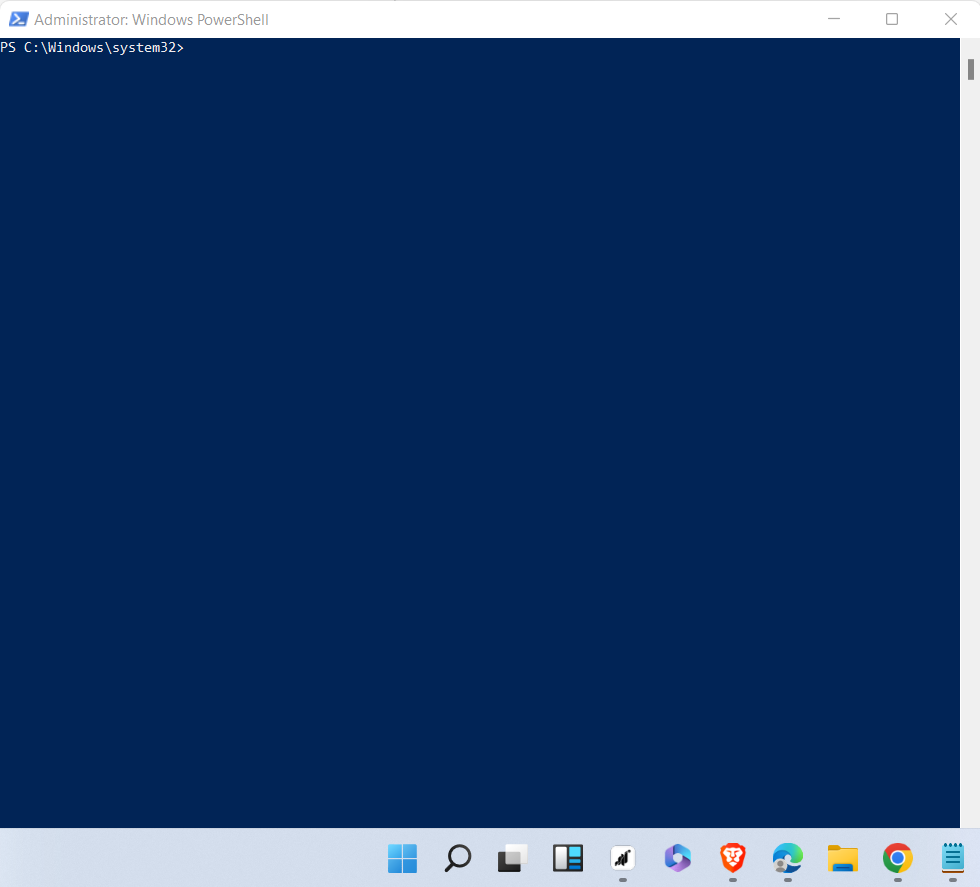

## **2. Chocolatey Installation**

___

Chocolatey lets you install apps with a single command.

- Open your browser's search box and type 'install chocolatey' to get the URL to the chocolatey official website [https://chocolatey.org/install](https://chocolatey.org/install)
- Expand Step 2 on the official page and then follow the installation instructions for **Individual use**

## add an image here

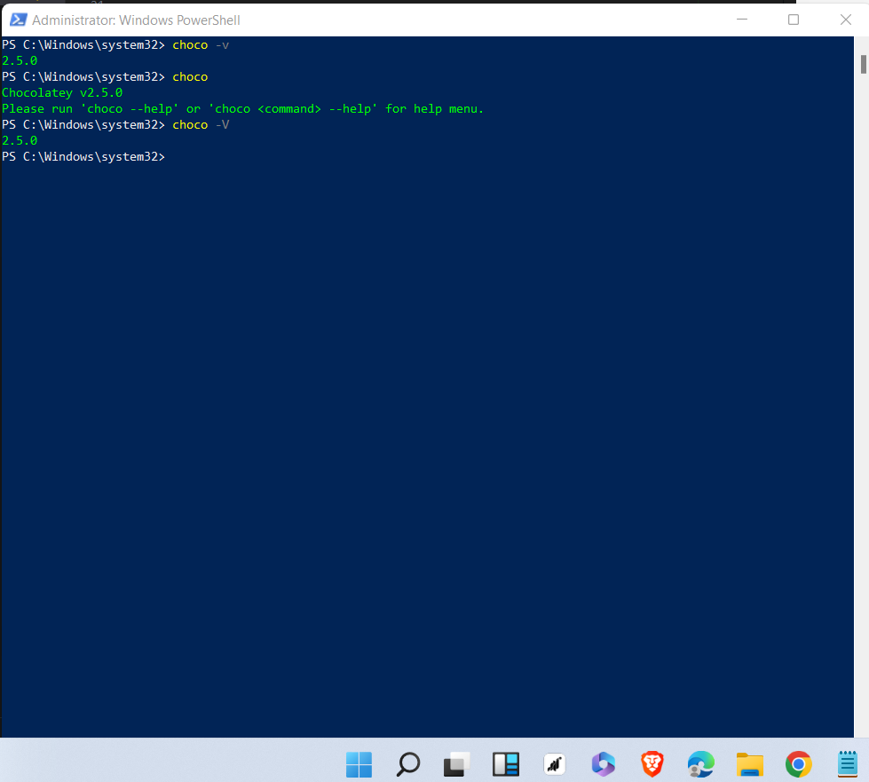

## **3. Virtual studio code (VS code) installation**

___

Developers use VS Code to effectively write, modify, test, and manage code.

- Access the official Visual Studio Code website at [https://code.visualstudio.com/](https://code.visualstudio.com/)
- I downloaded the installer that is appropriate for my operating system(windows).
- Launch the installer and go through the setup procedure.
- To simplify things, i accept the default installation parameters.
- To open VS code,follow these steps on your windows operating:
**Start → type "VS code" in the provided search bar → right-click and then Run**

## image verification

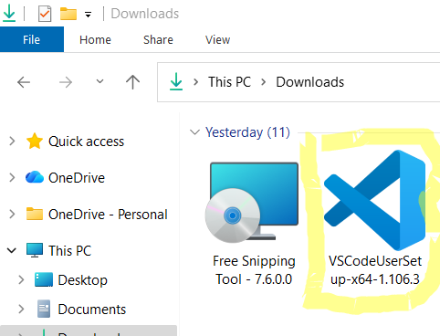
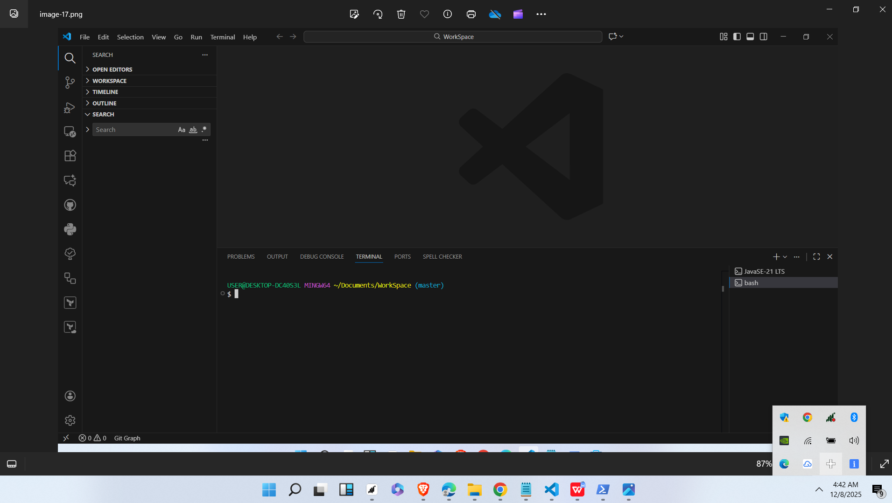

- Also, you can verify VS code installation and version when you run the command bellow

```powershell
code --version
```

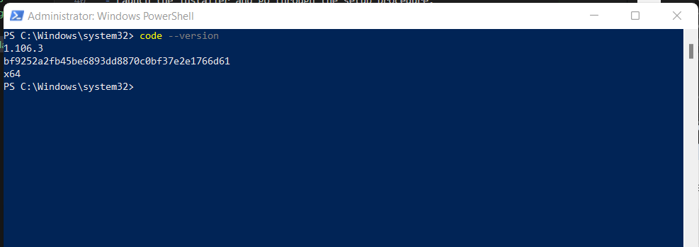

## VS Code Plugin Installation

___

- With VS Code running, click the Extensions icon in the Activity Bar on the side of the window.
- In the search field, put the necessary extension to add more features or tools such as Remote ssh, Bracket psir color,git graph,material icon theme,github actions, azure terraform,terraform hashicorp, start git bash, etc.
- Click **install** to install the extension, and the extension is ready to use.


## 4. GIT Installation

___

Git is a version control system for managing code and keeping track of file modifications.

- Download the appropriate software for your OS system by going to the official git website [https://git-scm.com/install/windows](https://git-scm.com/install/windows)
- Launch the installer and follow the instructions to ensure a successful installation.
- To verify the git installation, run the command below

```powershell
git --version
```

- Git is up and running if verification is successful

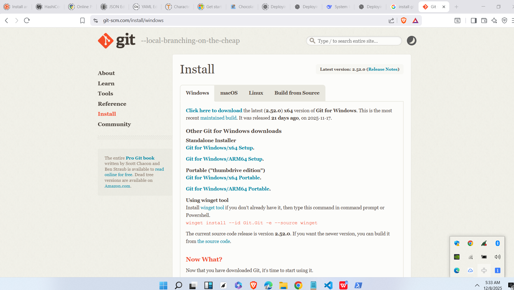
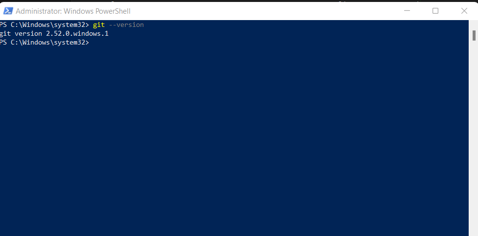

## 5. SSH Client, SSH Server, and SSH-agent Installation

___

- To manually download Openssh, go to [https://github.com/PowerShell/Win32-OpenSSH/releases](https://github.com/PowerShell/Win32-OpenSSH/releases).
- Carefully obtain the most recent Openssh ZIP  package compatible with your operating system.
- Once the OpenSSH-Win64.zip package file has been downloaded, right-click on it and extract it to C:\Program Files. OpenSSH
- Launch the Admin PowerShell installation script:

```powershell
cd "C:\Program Files\OpenSSH"
powershell.exe -ExecutionPolicy Bypass -File install-sshd.ps1
```

- Enable SSH server with the command

```powershell
Set-Service ssh-agent -StartupType Automatic
Start-Service ssh-agent
```

- Enabled SSH agent with the command

```powershell
Set-Service ssh-agent -StartupType Automatic
Start-Service ssh-agent
```

- To Verify OpenSSH Installation,run

```powershell

# Check SSH client
ssh -V
# Check SSH server status
Get-Service sshd
```

- If the **Test SSH** command functions flawlessly, OpenSSH is operational. Run

```powershell
ssh localhost
```

If it asks for a password, input the password OR generate SSH keys for passwordless login(recommended for DevOps workflows)

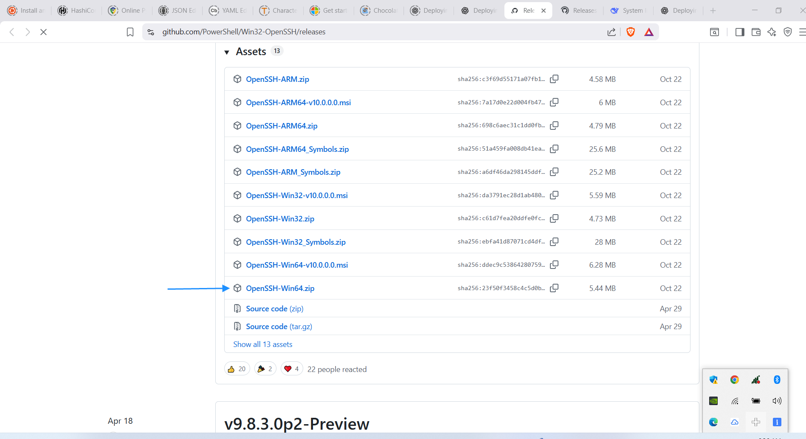

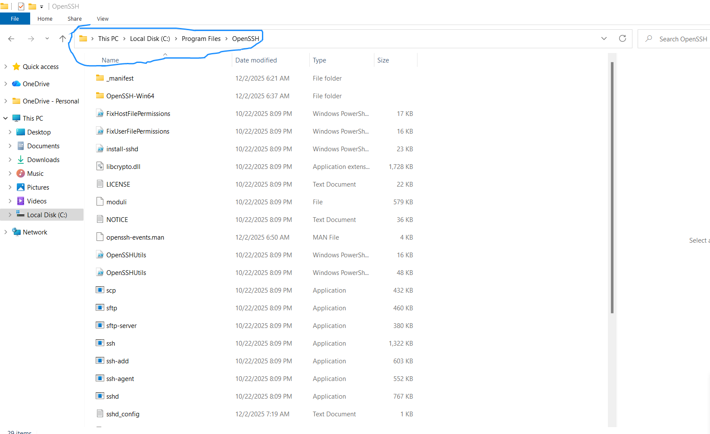

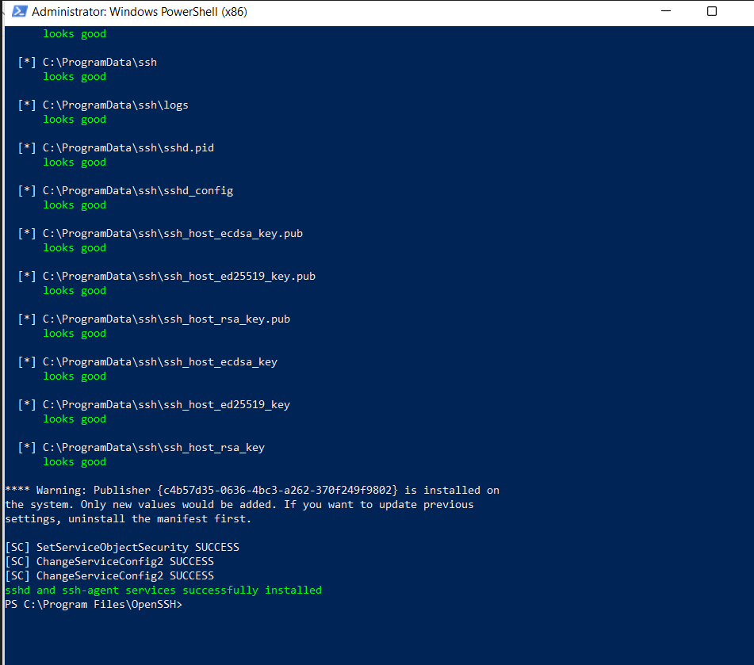

## 6. Generate a pair of SSH keys and add them to the SSH agent

___

- To generate SSH key, run the command bellow

```powershell

ssh-keygen
```

- Likewise, to generate key another using a different algorithm key

```powershell

ssh-keygen -t ed25519 -C "noblejoshua12@gmail.com"

```

To accept defaults, hit Enter; select a passphrase or leave it empty.  The SSH private and public sealed key is then displayed on the screen as having been successfully generated.  To view it, go in your program file's **.ssh** subdirectory.

### NB: On no condition must you expose your private key, keep it and protect with everything you have

- To Add ssh key generated to ssh-agent, run the command below with any choice of key algorithm used, it can be the `ssh-keygen OR ssh-keygen -t ed25519 -C "noblejoshua12@gmail.com"`

```powershell

ssh-add $env:USERPROFILE\.ssh\id_ed25519
```

- Next, use the following command to see the SSh key.

```powershell

Get-Content $env:USERPROFILE\.ssh\id_ed25519.pub | clip
```

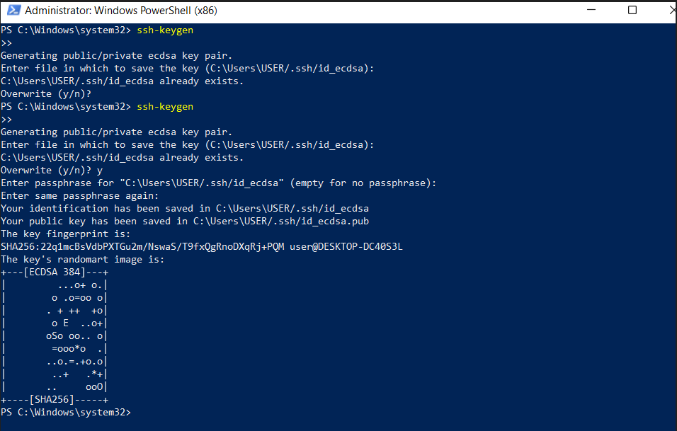

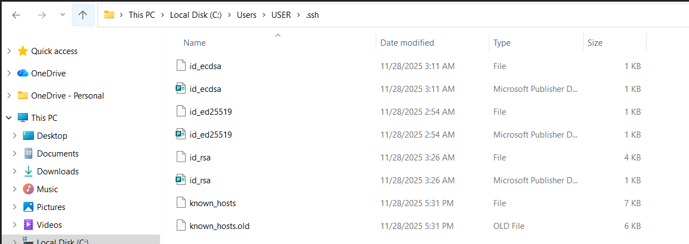

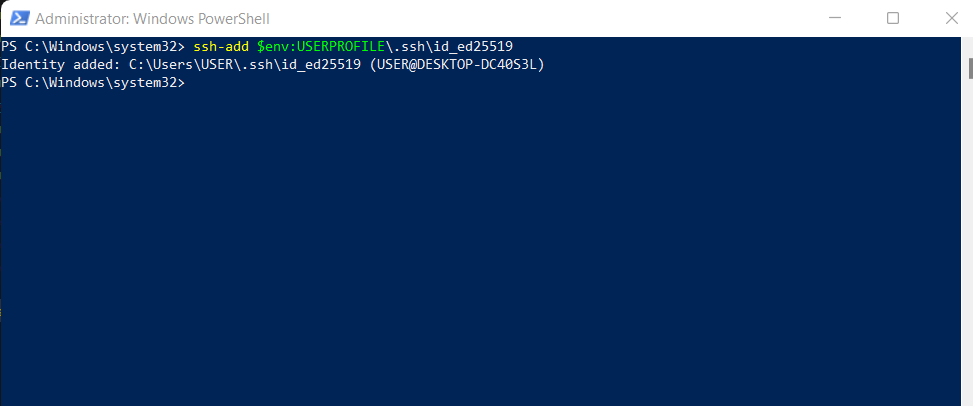

## 7. Register for a GitHub Account

___

- Visit the official github webiste through the link [https://github.com/signup?ref_cta=Sign+up&ref_loc=header+logged+out&ref_page=%2F%3Cuser-name%3E&source=header](https://github.com/signup?ref_cta=Sign+up&ref_loc=header+logged+out&ref_page=%2F%3Cuser-name%3E&source=header)
- Enter the required information (password, username, email address, and country) and tick the box to receive emails
- If requested, complete any CAPTCHA
- The address you provide will get a verification email from GitHub.To activate your account, click on the verification link.  SSH Key Addition for GitHub

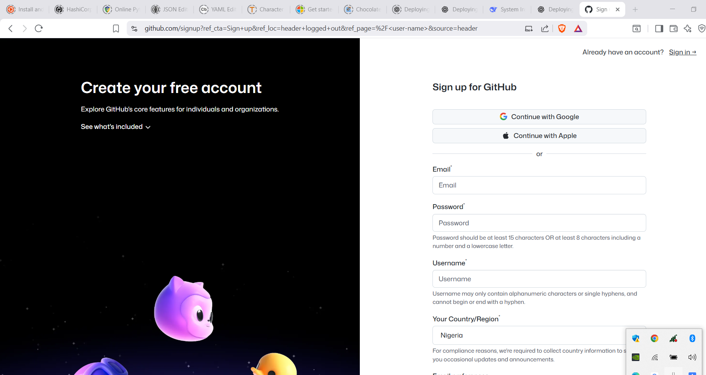

## 8. Copy Public Key to GitHub

___

- Run the command bellow to get your public key

```powershell(Admin)
cat ~/.ssh/id_ed25519.pub
```

- Proceed to github, select **Settings → SSH and GPG Keys → New SSH → KeyPaste key → Save**

## **9. Create a Workspace in VS Code**

___

- Navigate to the document folder in your window explorer.  Make a new folder called **workspace** inside the document folder.
- Returning to your VS code now, Go to **File → Open Folder → Select it**
- your folder is up for repository cloning and other github workflow

## **10. Clone a repository on GitHub (git clone)**

___

- Go to [https://github.com](https://github.com) and log in using the information you gave when creating your github account
- Click the top-right symbol.Click "New repository
- Enter the repository's details, such as your name:  your-project-name,  Description: (Optional) Visibility: Public or Private
- You should Add a default README file, set gitignore to false, and ignore the license for the time being.  Choose "Create repository
- insdie the repository, just towards the right side of your screen, you will find **code**, click it you will find the repository HTTPS, SSH, GITHUB CLI address. copy any to get the cloning done on Vs code editor
- Clicking the **code** button, which is inside the repository on the right side of your screen, will reveal the HTTPS and SSH address of the repository.   Copy any address script and execute it in the Vs code editor with your position within the workstation folder to finish the cloning process.  Once you have verified that you are at your workstation, run

```powershell
git clone git@github.com:JoshuaGoldd/System-Installation-Course.git
```

- You should see your repo in you local computer if carefully and successfully done. Very Good.
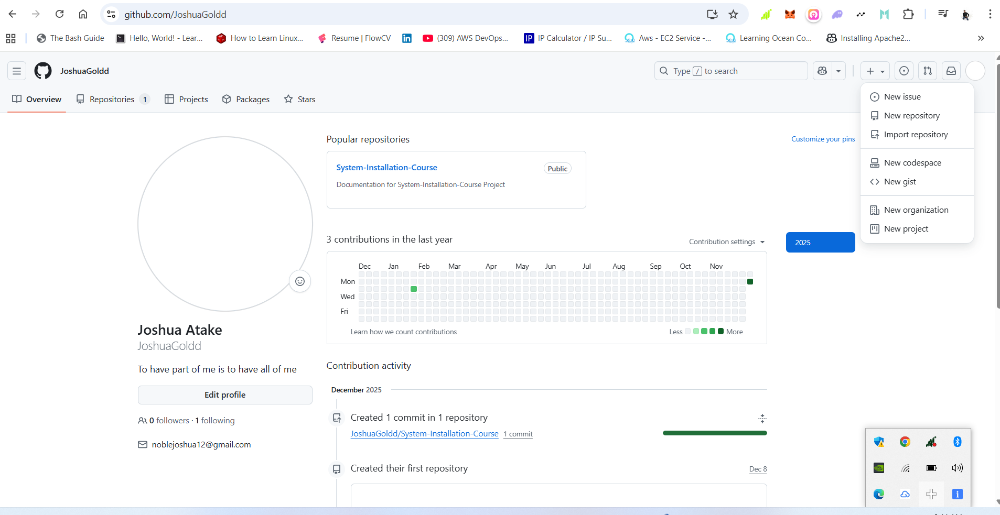
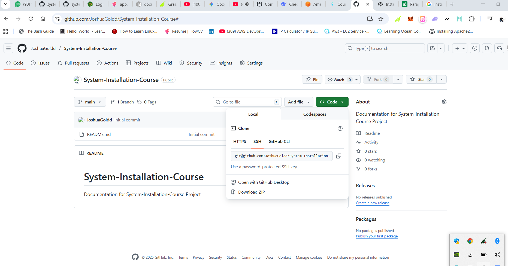

## 11. The fundamental Git workflow (add → commit → push)

___

- Run the command below when you are about to upload the job you have done on your local computer to github repository

```powershell
git add .
git commit -m "title of the change made"
git push
```

It will push right away if the SSH key is set correctly

## Thank you for your urgent attention to this matter
